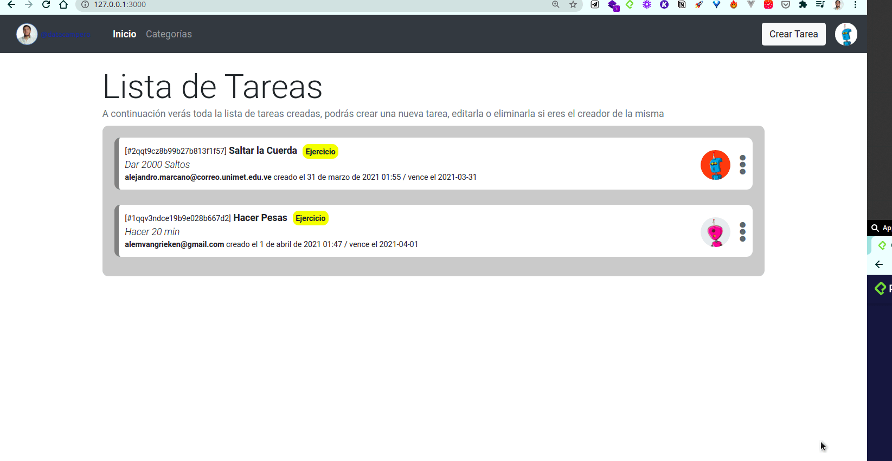

# 📝 TODO APP in Ruby on Rails




Esta app fue desarrollada para conocer lo escencial del framework MVC de Ruby on Rails. Es un gestor de tareas que cuenta con las siguientes funcionalidades


## Comenzando 🚀
_Estas instrucciones te permitirán obtener una copia del proyecto en funcionamiento en tu máquina local para propósitos de desarrollo y pruebas._

Mira **Deployment** para conocer como desplegar el proyecto.

### Pre-requisitos 📋

Tener instaladas las siguientes tecnologías
* Rails 2.7.0
* PostgreSQL 12
* yarn

Cambia la base datos por tu base de local postgresql
```
development:
  <<: *default
  database: organizador_development
  host: localhost
  user: yourusername
  password: yourusername
```
Crea la base de datos desde rails con:
```
rails db:migrate

```
Realiza las migraciones de los modelos a la base de datos con:
```
db:migrate

```

### Instalación 🔧
Para la instalación de las gemas corre el siguiente comando

```
 bundle install   
```

Para levantar el servidor en localhost puerto 3000 correr:
```
rails server
```

## Despliegue 📦

El deploy se realizó con heroku. vercel. Para ver accede a: 

## Construido con 🛠️

* [Dropwizard](http://www.dropwizard.io/1.0.2/docs/) - El framework web usado
* [Maven](https://maven.apache.org/) - Manejador de dependencias
* [ROME](https://rometools.github.io/rome/) - Usado para generar RSS

## Autores ✒️

_Menciona a todos aquellos que ayudaron a levantar el proyecto desde sus inicios_

* **Alejandro Marcano** - - [datacampero](https://github.com/datacampero)


## Licencia 📄

Este proyecto está bajo la Licencia (Tu Licencia) - mira el archivo [LICENSE.md](LICENSE.md) para detalles

⌨️ con ❤️ por [datacampero](https://github.com/datacampero) 😊